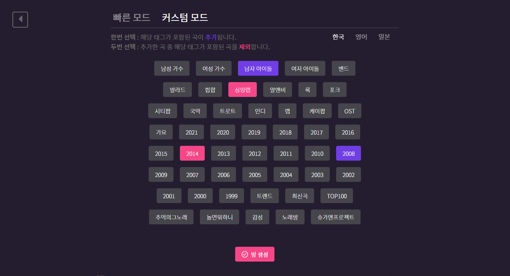

 
 

  

 

  <strong>노래 맞추기 게임, CatchMuz !</strong>
   
  플레이어들과 경쟁하면서 빠르게 노래 제목을 맞춰보세요

  
 

 
 

## 🎵 노래 추가하기
모든 노래 데이터는 [catchmuz-서버](https://github.com/kyechan99/catchmuz-server/tree/main/song) 에 저장되어 있습니다.

중복되지 않는 노래를 JSON 형태에 맞추어 PR, ISSUE 주시면 감사하겠습니다.

태그에 따라서 (ex. 추억의그노래) 대체로 대부분의 사람이 알 수 있는 노래가 좋지만 무조건은 아닙니다.

유명도에 따라서 태그의 양이 늘려야 해당 노래가 자주 나옵니다.

모든 태그들은 [태그 목록](https://docs.google.com/document/d/1mjIdfzpKzum6Xd-ZZWtcW51r3f4qIdROXcn5sTEykv4/edit?usp=sharing)에서 관리합니다.

## 👀 How to play

### 방 생성하기

`최대 노래 수`는 최대 몇 곡 까지 재생할지 지정합니다. 2곡 ~ 1000곡 까지 선택 가능합니다.

`최대 인원 수`는 최대 몇명 까지 방에 진입할 수 있는지 지정합니다. 최대 10명까지 입장 가능합니다.

`빠른 모드`를 이용해 관련된 노래 들을 재생해 줍니다.

`커스텀 모드`를 이용해 관련 노래 태그를 직접 선택해서 재생합니다. '남자아이돌', '여자아이돌'을 선택했다면 둘 중 하나라도 포함된 노래가 재생됩니다.

### 게임 시작

인원 수가 적당히 충족되었을 때에 방장이 게임을 시작합니다.

### 게임 플레이

게임이 시작되면 설정한 태그에 해당된 노래들이 재생됩니다.

50초간 노래를 맞출 수 있는 시간이 주어지며 **가장 먼저 맞춘** 플레이어에게 점수가 부여됩니다.

정답자가 나오거나 50초가 지난 후에는 노래 정보가 나옵니다. 10초 정도의 대기 시간이후 다음 노래가 재생됩니다.

### 스킵하기

노래를 일찍 맞추어 스킵하고 싶거나 전혀 맞출 수 없다면 플레이어의 과반수 투표를 통해 넘길 수 있습니다.

스킵은 가운데 `스킵 버튼` 이나 `!skip` 혹은 `!스킵` 명령어를 통해 가능합니다.

